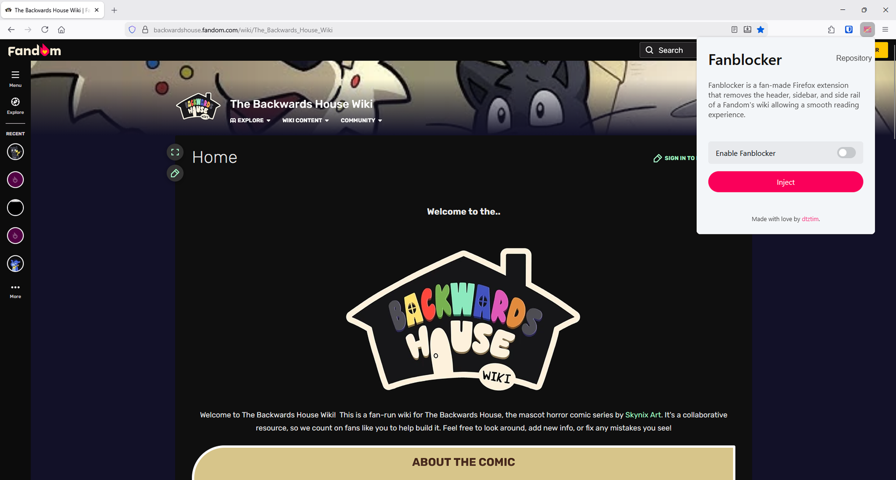
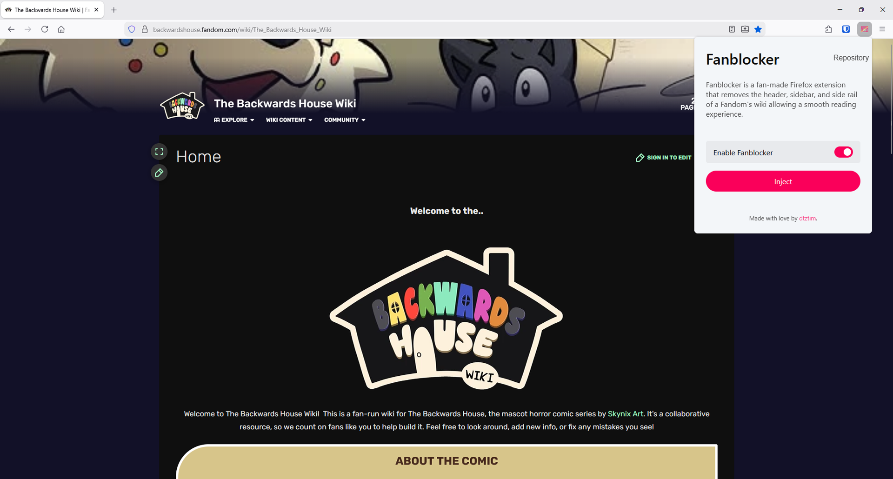

# Fanblocker - Fandom Disruption Blocker

Fanblocker is an open-source fan-made extension for [Firefox](https://firefox.com) that removes the header, sidebar, and side rail of a [Fandom](https://fandom.com) Wiki page in real time, providing a smooth reading experience without the previous distractions that annoy many users to this date.

Fanblocker **does not** remove advertisements. For this I recommend [uBlock Origin for Firefox](https://addons.mozilla.org/en-US/firefox/addon/ublock-origin/) made by [Raymond Hill](https://github.com/gorhill).

## Preview

[The Backwards House](https://backwardshouse.fandom.com) wiki **before** enabling Fanblocker.

[The Backwards House](https://backwardshouse.fandom.com) wiki **after** enabling Fanblocker.

Preview use the [Fandom](https://fandom.com) wiki of [The Backwards House](https://backwardshouse.fandom.com).

## Contributions

You're welcome to contribute to the project by submitting a [pull request](./pulls). I do not have any contributions guidelines.

If you find any bug and cannot help fix it, feel free to [submit an issue](./issues) and I'll do my best to fix it.

## License

*Licensed under [MIT](https://opensource.org/license/mit).*

Feel free to contribute, fork, do anything you want with it!

